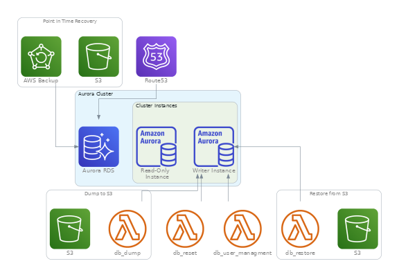

# Documentation

## Introducción

El Wrapper de Terraform para DocumentDB simplifica la configuración del Servicio de Base de Datos MongoDB compatibles en la nube de AWS. Este wrapper funciona como una plantilla predefinida, facilitando la creación y gestión de Balanceadores al encargarse de todos los detalles técnicos.

**Features**
- [Registro DNS](#registro-dns)

**Diagrama** <br/>
A continuación se puede ver una imagen que muestra la totalidad de recursos que se pueden desplegar con el wrapper:

<center></center>

---

## Modo de Uso
```hcl
documentdb_parameters = {
  "00" = {
    subnets = data.aws_subnets.public.ids
    # vpc_name    = "" # Default: ${local.common_name} (dmc-prd)

    master_username = "user"
    master_password = "password"

    # Opcional: Por default abierto el puerto al CIDR de la VPC
    # ingress_with_cidr_blocks = [
    #   {
    #     rule        = "mongodb-27017-tcp"
    #     cidr_blocks = "0.0.0.0/0"
    #     description = "Enable all access"
    #   }
    # ]
    dns_records = {
      "" = {
        zone_name    = "${local.zone_public}"
        private_zone = false
      }
    }
  }
}

documentdb_defaults = var.documentdb_defaults
```
<details>
<summary>Tabla de Variables</summary>

| Variable            | Description                                                         | Type    | Default             | Alternatives                            |
|---------------------|---------------------------------------------------------------------|---------|---------------------|-----------------------------------------|
| create_enable       | Enables or disables the creation of the DocumentDB cluster          | `bool`  | `true`              | `false`                                 |
| database_name       | Name of the DocumentDB database                                     | `string`| `"${local.common_name}-${each.key}"` | Custom database name                   |
| cluster_identifier  | Identifier for the DocumentDB cluster                               | `string`| `"${local.common_name}-${each.key}"` | Custom cluster identifier              |
| master_username     | Master username for the database                                    | `string`| `lookup(each.value, "master_username")` | Manually defined username              |
| master_password     | Master password for the database                                    | `string`| `lookup(each.value, "master_password")` | Manually defined password              |
| storage_encrypted   | Enables storage encryption for the database                         | `bool`  | `"true"`            | `"false"`                               |
| deletion_protection | Enables deletion protection for the DocumentDB cluster              | `bool`  | `"true"`            | `"false"`                               |
| instance_class      | Instance class for DocumentDB instances                             | `string`| `"db.t3.medium"`    | `Custom type` |
| security_group_ids  | List of security group IDs for the DocumentDB cluster               | `list`  | `[module.security_group_documentdb[each.key].security_group_id]` | Custom security group IDs              |
| subnets             | List of subnets where DocumentDB instances will be deployed         | `list`  | `lookup(each.value, "subnets", null)` | Manually defined subnet list           |
| instances           | Number of DocumentDB instances to be created                        | `number`| `lookup(each.value, "instances", 1)` | Custom number of instances             |
| vpc_name                             | (optional) Custom VPC Name                                                  | `string`| `${local.common_name}` (dmc-prd)                   | Custom VPC Name           |

</details>

---

## Modo de Uso Avanzado

### Registro DNS
Da de alta un registro DNS de tipo CNAME en una hosted zone de Route53 que este presente dentro de la cuenta, la misma puede ser publica o privada dependiendo del tipo de visibilidad del registro que se desee.
<details>
<summary>Código</summary>
```hcl
dns_records = {
  "" = {
    zone_name    = local.zone_private
    private_zone = true
  }
}
```
</details>